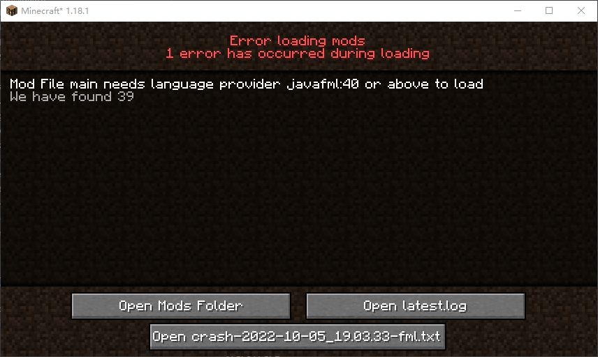

有关环境配置：https://blog.csdn.net/weixin_50551652/article/details/109807874

注意事项: 环境变量要删除 ORacle\java\javapath

MinecraftForge  中文文档
https://mcforge-cn.readthedocs.io/zh/latest/

### mac 版java 环境安装

https://www.oracle.com/java/technologies/downloads/#java11-mac

查看JDK安装后的路径
在终端输入以下命令查看JDK地址
$ /usr/libexec/java_home -V

配置环境变量
touch .bash_profile
open -e .bash_profile
在里面添加

```bash
JAVA_HOME=/Library/Java/JavaVirtualMachines/jdk-11.0.15.1.jdk/Contents/Home
PATH=$JAVA_HOME/bin:$PATH:.
CLASSPATH=$JAVA_HOME/lib/tools.jar:$JAVA_HOME/lib/dt.jar:.
export JAVA_HOME
export PATH
export CLASSPATH
```

输入一下命令检查环境变量的路径，查看是否配置成功。
$ echo $JAVA_HOME

There is no valid JAVA_HOME setting to launch Gradle Language Server. Please check your "java.jdt.ls.java.home" setting.

  "java.jdt.ls.java.home": "/Library/Java/JavaVirtualMachines/jdk-11.0.15.1.jdk/Contents/Home",

如果环境变量失效
$ source .bash_profile
$ java -version

然后打开 mdk 代码构建 gradle 如果构建报错 删除.gradle文件重新构建

cd ~
rm -rf .gradle

vscode Java - Import Errors and More
按 ctrl+shift+p 然后搜索“java clean”并单击“java: clean java language server workspace”然后单击重新启动 IDE。

### gradle安装报错

vscode 安装上gradle插件点击 Tasks->build setup-> init
icu4j-70.1.jar 安装不上
官方文档:https://unicode-org.github.io/icu/userguide/icu4j/

### gradle版本报错

**Could not find method testCompile() for arguments [] on object of type org.gradle.api.internal.artifacts.dsl.dependencies.D**

> **compile** and **testCompile** configurations are removed in Gradle 7+. You can use **implementation** and **testImplementation** instead.
>
> gradle7+ 版本不能使用testCompile 了 改成testImplementation

```
dependencies {
    testImplementation group:'junit', name:'junit',version:'4.12'
}
```

### Javafml 版本错误

Forge 官方mdk  版本是40 启动客户端会报以上错误, 将版本修改为39就可以了




