# React Native

React 框架可以开发 WEB ，也可以开发手机 APP，React Native 就是开发手机 APP 技术。

## 移动端开发介绍

开发手机APP的方法：

1. 原生开发：需要使用 IOS需要object-c ，Anroid 需要Java
2. 混合开发：使用 html、css、JS 进行开发，然后打包成手机 APP，比如：uniapp、phonegap等
3. React Natve：使用 HTML 、CSS 、JS 来写代码，编译成原生的APP。

## 搭建运行环境 

相关软件下载地址：

JDK1.8链接：https://pan.baidu.com/s/1ueTfaZkpvhBJjCtsbg-gVQ 提取码：snjc

Android Studio 下载地址：从此下载：https://developer.android.google.cn/studio#downloads

python2 下载地址：https://www.python.org/ftp/python/2.7.17/python-2.7.17.amd64.msi

下载并按着官方文档的步骤安装。

安装完之后可以启动一个虚拟机：

# 创建项目

~~~
npx react-native init 项目名称
~~~

创建完之后，启动项目：

~~~
yarn android      --> 安装到 android 虚拟机并运行
yarn ios          --> 安装 ios 虚拟机上（必须要苹果电脑上）
~~~

安装完项目之后，其中 App.js 就是根组件，我们启动之后看到的页面就是 App.js 这个文件中的内容

App.js中的内容：

修改 App.js

第一个页面：Hello World

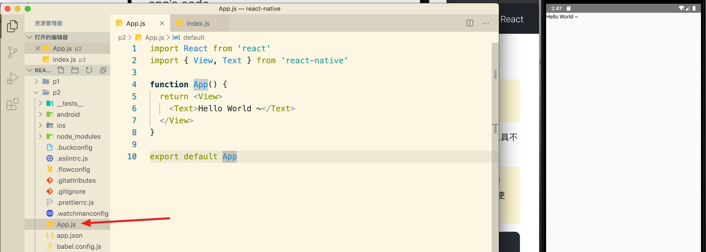

# 快速入门

## 组件

在 RN 里面并没有 HTML 标签。必须要使用 RN 中的组件来实现功能。

RN 中的组件分为：

1. RN 中内置的组件（比如 View、Text 等）
2. 社区开源组件：https://reactnative.directory/

## 基础组件

RN 中最常使用的组件：

View：类似于 HTML 中的 div 标签，主要是用来实现布局。

Text：所有的文本内容必须要写在 Text 组件中。

Image：显示图片适当于 img

FlatView：制作长的数据列表等等。

### Text 组件

所有的文本内容必须要写在 Text 组件中

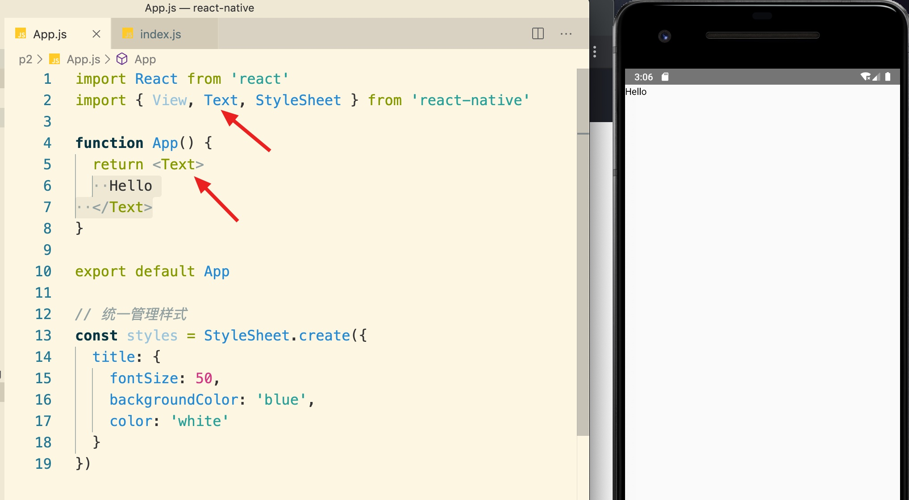

### View 组件

主要用来布局。

示例、实现9宫格。

### Image

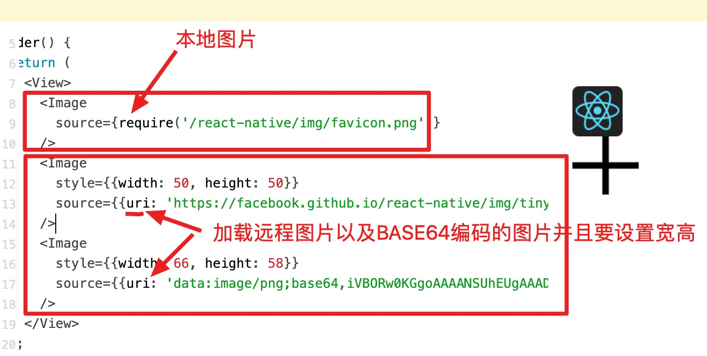

默认情况下 gif 动图无法正常显示，需要：

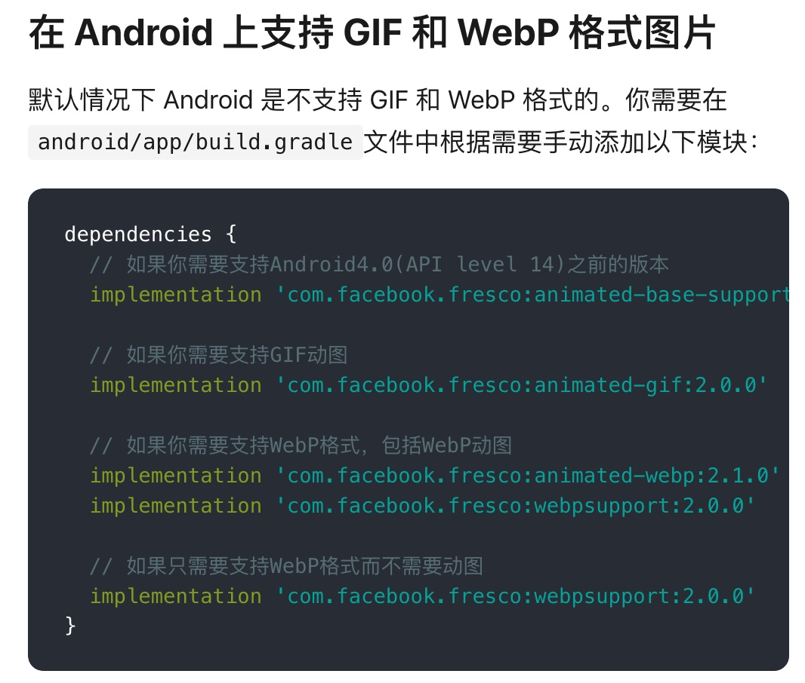

添加之后需要重新关闭命令行，重新执行 `yarn android` 重新打包一下。

## 社区组件

### 轮播图

1. 先找一个组件

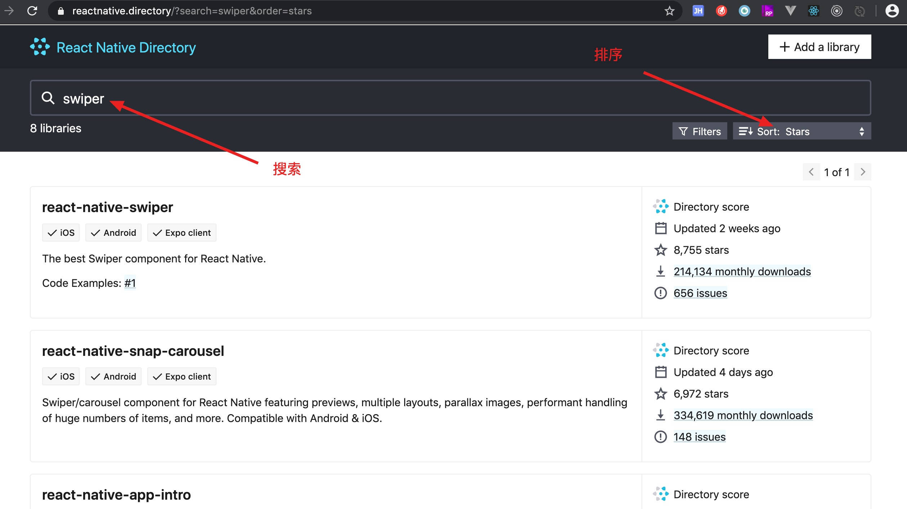

2. 查看文档https://github.com/leecade/react-native-swiper
3. 安装

~~~
npm i react-native-swiper --save
~~~

4. 写代码

~~~js
import React from 'react'
import { View, Image, Text, StyleSheet } from 'react-native'

import Swiper from 'react-native-swiper'

function App() {
  return <Swiper style={styles.wrapper} horizontal={false} autoplay={true}>
    <View style={styles.slide1}>
      <Text style={styles.text}>Hello Swiper</Text>
    </View>
    <View style={styles.slide2}>
      <Text style={styles.text}>Beautiful</Text>
    </View>
    <View style={styles.slide3}>
      <Text style={styles.text}>And simple</Text>
    </View>
  </Swiper>
}

export default App

const styles = StyleSheet.create({
  wrapper: {},
  slide1: {
    flex: 1,
    justifyContent: 'center',
    alignItems: 'center',
    backgroundColor: '#9DD6EB'
  },
  slide2: {
    flex: 1,
    justifyContent: 'center',
    alignItems: 'center',
    backgroundColor: '#97CAE5'
  },
  slide3: {
    flex: 1,
    justifyContent: 'center',
    alignItems: 'center',
    backgroundColor: '#92BBD9'
  },
  text: {
    color: '#fff',
    fontSize: 30,
    fontWeight: 'bold'
  }
})

~~~

效果：

## 样式

在 RN 中不能直接编写  CSS 样式，必须要把 CSS 写成 JS 的对象来使用。

设置样式有两种方式：

1. 在组件上直接使用 styles 属性
2. 使用 `StyleSheet` 来创建统一管理的样式

示例演示：在 RN 中两种应用样式的方法：

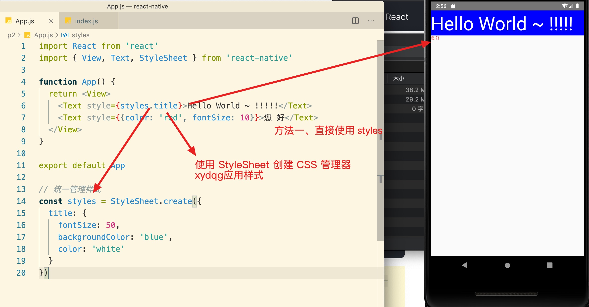

注意：

1. 数字值时一般不需要添加单位
2. 在RN中很多WEB中的CSS 是不好使的，比如：float。
3. 在 RN 中一般使用  flex 进行布局。
4. RN 中的 CSS 都要写成一个 JS 对象
5. 名称必须是小骆峰方式来写，比如 background-color 到RN就是:backgroundColor

# 网络

实际开发 APP 时肯定需要调用接口，在 RN 中调用接口有三种方式：

1. 自带-原生的 AJAX（XMLHttpRequest）
2. 自带-使用 fetch 方法
3. 第三方的包：axios

示例、使用 `fetch` 调用商品接口制作商品列表功能

# FlatList 组件

当我们需要制作一个长数据列表、可以滚动的列表时可以使用 `FlatList` 组件。

# Button 组件

# Icon 图标

我们在开发时经常需要使用一些图标。

在 RN 中使用图标时，我们可以找一下开源的仓库中查找。

1. 安装

~~~
npm install --save react-native-vector-icons
~~~

2. 配置

在 Android 系统中要使用图标需要配置。

修改 `android/app/build.gradle` 文件，添加一行到最后：

~~~
apply from: "../../node_modules/react-native-vector-icons/fonts.gradle"
~~~

3. 选择要使用的图片类

图标查看地址：https://oblador.github.io/react-native-vector-icons/

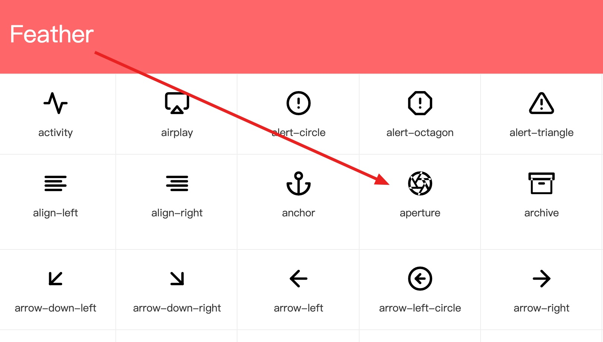

~~~js
import Icon from 'react-native-vector-icons/Feather';

<Icon name="aperture" size={30} color="#900" />;
~~~

4. 重新打包项目

# StatusBar

可以通过这个组件设置手机应用状态栏。

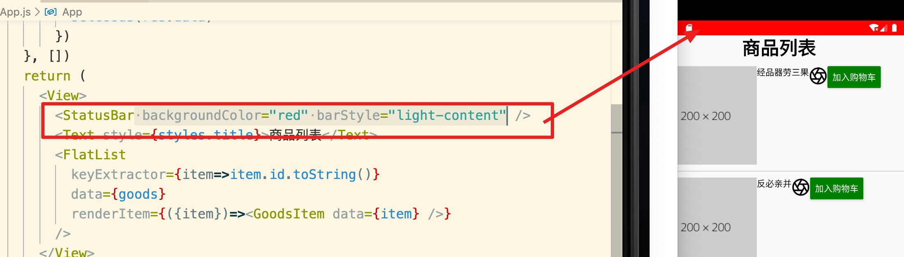

除了可以直接使用组件之外，组件还提供了些静态方法：

然后我们可以通过调用这些方法来实现功能：

# 判断手机平台 

在不同的手机系统上，有些组件和API用法不同。

 比如 AlertIOS 组件只能在苹果手机上运行。

所以在不同的手机 上同一个功能代码可能不一样，所以我们在写代码时就要根据平台来编写不同的代码。

那么我们如何判断当前手机运行在哪个平台上？

可以使用 `Platform` 来判断当前的平台。

# Flex 布局要注意的地方

## 使用 flex

直接 `flex: 1` 即可。

## flex 布局时的高度

1. 当开启 flex 布局，高度就是父元素的高度
2. 如果最顶层元素开启了 flex 布局，高度就是 100%

## flex 后面的数字代表比例

## flex 默认是垂直的

在网页中 flex 布局默认是水平排列的，但是 RN 中默认是垂直排序的。

如果要水平排列可以使用 `flexDirection: 'row'`。

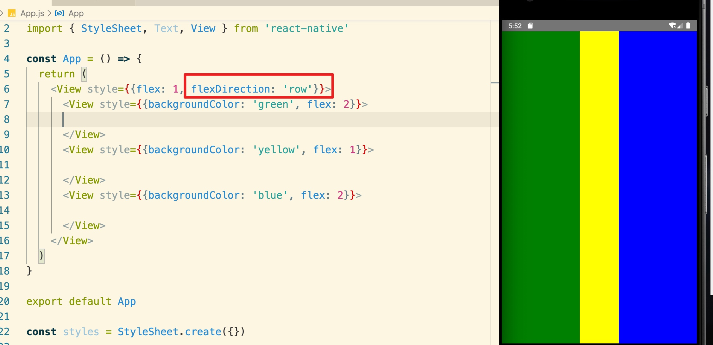

## rn 中的定位

在网页中定位有四种，但是在 RN 只有两种：absolute，relative。

absolute 在网页中是相对于窗口定位，而在 RN 中是相对于父元素定位。

## 盒子居中

在网页中直接 `margin: 0 auto` 即可，但是在 RN 中要分开写，否则会导致APP退出：

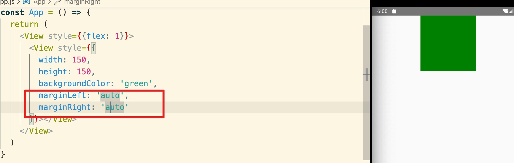

## CSS 3中的动画、过滤不能使用了~

## 背景图

在 RN 中不能使用 `background-image` 来设置背景图。不过，可以使用一个 `ImageBackground` 的组件来实现背景图功能。

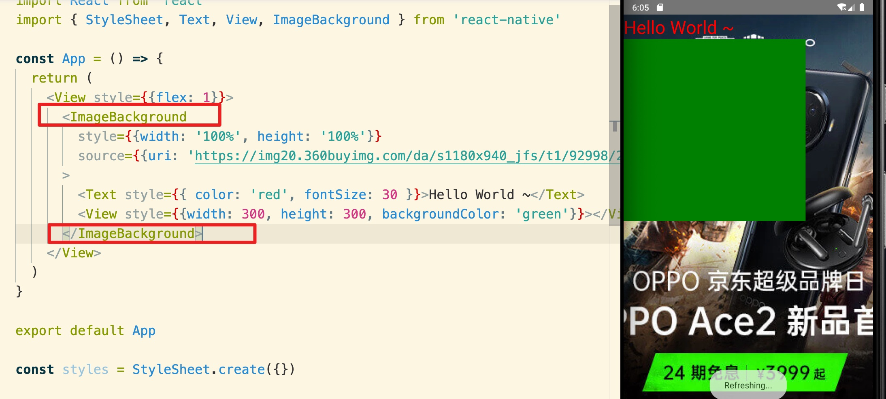

## 获取屏幕尺寸

有些时候，我们需要知道手机屏幕的宽、高。

要吧通过 `Dimensions` 组件获取屏幕的宽、高。

